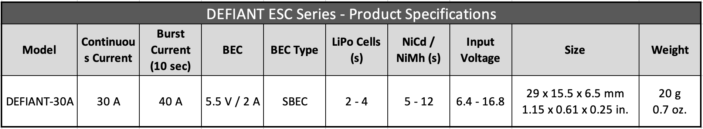
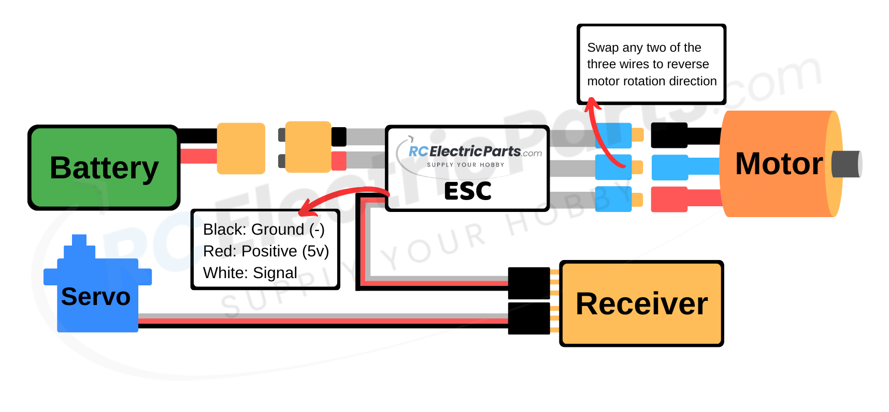
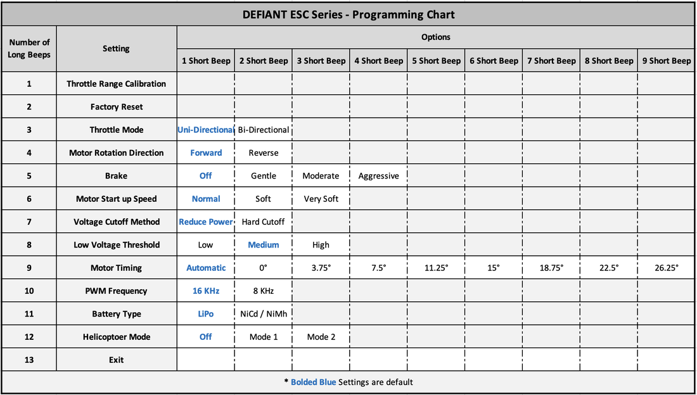
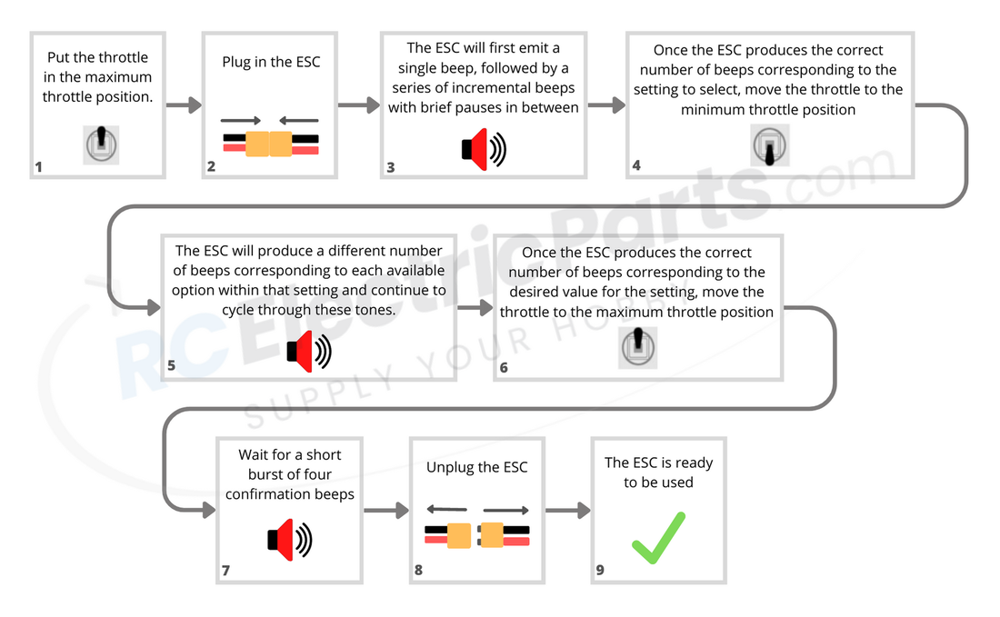
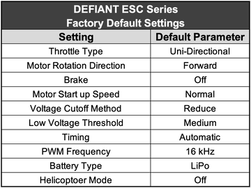

# DEFIANT ESC Series

https://www.rcelectricparts.com/defiant-esc-user-guide.html#10

## 01 Main Features:

Multi-Directional Technology

- The DEFIANT ESC features our innovative Multi-Directional Technology, enabling it to function as either a uni-directional or bi-directional ESC.
Scannable QR Code to the User Manual on the product itself.
- Never worry about keeping track of the user manual.
- Plug-and-play with changeable settings.
- Compact size and light weight construction.
- Multiple protections, including abnormal startup, low-voltage, overheat, and throttle signal loss protection.
- Unique circuit design for strong anti-interference capabilities.
- Start mode and throttle response can be easily set for fast and smooth speed control.
- Automatic identification of battery cells.
- High-power safety performance ensures that the motor will not start immediately - regardless of the throttle stick position.
- Working condition can be determined via tones.
- The programming menu is easy to operate and easy to change settings via transmitter or programming card sold separately.
- Built-in BEC provides high output power with low power loss.  
- Uses a powerful high-performance microcontroller processor, which provides several of the listed features.
- Supports high RPM motors.
- Multiple protections, including abnormal startup, low-voltage, overheat, and throttle signal loss protection. See section section 08 ESC Safety Features and Protections section for more information for each safety feature.​
- Calibrate starting motor throttle position. See 04 First-time Use | Throttle Mode and Calibration for more information.
- Quick, linear, and stable throttle response that maintains a constant motor speed.
- Integrated SBEC/UBEC provides high current efficiency with minimal heat loss compared to a standard BEC.
- It can be used in model airplanes, drones, helicopters, boats, cars, and other applications where a brushless motor needs to be controlled.

## 02 Product Specification

## 03 Wiring diagram

## 04 First-time Use | Throttle Mode and Calibration

### STEP 1: Throttle Mode | Confirming Uni-directional or Bi-directional Operation

The DEFIANT ESC features our innovative Multi-Directional Technology, enabling it to function as either a uni-directional or bi-directional ESC. By default, the ESC ships in uni-directional mode (motor spins in one direction only). If this mode suits your needs, you can skip this step and proceed to step 2. However, if you require the ESC to operate in bi-directional mode (motor spins in both directions), simply follow the instructions below to change the setting.

*If needed, see section 07 programmable settings under setting "7. Throttle Mode" for more information about the difference between uni- and bi-directional modes.

Changing the Throttle Mode:

1. Set the transmitter's throttle to the maximum position.
2. Connect the ESC to power.
3. The ESC will begin by emitting a single beep via the motor, followed by a brief pause. It will then incrementally produce more beeps, with a short pause between each set of beeps.
4. Wait for the ESC to emit three beeps.
5. Before the ESC emits four beeps, move the throttle to the minimum position.
6. The ESC will repeatedly alternate between emitting one and two beeps, with a brief pause in between. To activate the desired throttle type, follow the instructions below:
7. Uni-directional Mode: Wait for the ESC to emit ONE beep, then proceed to the next step.
8. Bi-directional Mode: Wait for the ESC to emit TWO beeps, then proceed to the next step.
9. Set the throttle to the minimum position.
10. After a few seconds, the motor will produce four rapid alternating beeps to confirm that the throttle type has been saved.
11. Power off the ESC.
12. The Throttle Mode has been saved. Next continue to Step 2: Throttle Calibration Procedure​ to help ensure the smoothest throttle operation.

*Note: Ensure a motor is connected to hear the beeps, as the ESC generates sound through the motor.

### STEP 2: Throttle Calibration Procedure

The ESC is designed for plug-and-play operation, and typically, there is no need to modify the settings (programming). However, we recommend performing a throttle range calibration when using the ESC for the first time or when changing receivers. This calibration establishes the minimum and maximum throttle points, ensuring smooth and precise throttle control.

​If you wish to modify the ESC's settings, refer section 06 How to Change The ESC's Settings (Programming) for more detailed instructions.

1. Set the transmitter's throttle to the maximum position.
2. Connect the ESC to power.
3. After a few seconds, the ESC will begin by emitting a single beep via the motor, followed by a brief pause.
4. Before the ESC emits two beeps, move the throttle to the minimum position.
5. Within a few seconds the ESC will make a series of tones confirming the throttle has been calibrated.
6. Power off the ESC.
7. The ESC is now ready for use. Follow the Normal Operating Procedure. (Next section below)
​
*Note: Make sure a motor is connected to hear the beeps, as the ESC generates sound through the motor.

## 05 Normal Start up Procedure

Welcome to the Normal Startup Procedure section of the ESC user manual. In this section, we will guide you through the essential steps for using the ESC, along with an explanation of some different situations and tones you might encounter during operation. By following these instructions, you will ensure a smooth and efficient experience with your ESC.

Normal Start-up Procedure:

1. Set the throttle to the zero-throttle position (refer to Section 04: First Time Use | Throttle Mode and Calibration for changing the ESC throttle mode between uni-directional and bi-directional):
   1. Uni-directional Mode: Zero-throttle position is the minimum throttle position, typically achieved by moving the transmitter stick all the way down.
   2. Bi-directional Mode: Zero-throttle position is the center of the throttle range. Most transmitters set up for bi-directional use have a spring that moves the throttle to the center.
2. Connect the ESC to power. The ESC may exhibit the following responses, depending on the throttle position:
   1. If the throttle is partially on, the ESC enters Safe Start Protection mode, making rapid short beeps until the throttle is moved to the zero-throttle position. See section 08 ESC Features and Protections for more information.
   2. If the throttle is close to the maximum position, the ESC enters Programming mode. The ESC will emit a series of incrementing beeps via the motor, with brief pauses between each set of beeps. Each set of beeps corresponds to a different setting to program. In this case, power off the ESC and restart with the throttle in the zero-throttle position. For more information, see section 06 How to Change the ESC's Settings (Programming).
3. The ESC will emit a series of short beeps:
   1. The first set of beeps indicates the number of battery cells detected by the ESC (e.g., 3 beeps for a 3-cell battery). If necessary, change the ESC's battery-type setting (default is LiPo). See section 06 How to Change the ESC's Settings (Programming) for more information.
   2. The second set of beeps indicates the brake setting:
      1. One beep for the brake on.
      2. Two beeps for the brake off.
4. The ESC is now ready for use.

	
## 06 How to change the ESC Settings (Programming)

The DEFIANT ESC series is designed as plug-and-play, requiring no programming to function. However, the settings can be modified using the transmitter. Although it may seem daunting, we have provided detailed steps below to guide you through the process.

### Changing ESC Settings Using the Transmitter

PROGRAMMING CHART

The ESC will emit incrementing beeps via the motor, pausing briefly between each set. Each set of beeps corresponds to one of the 12 programmable settings. If no settings are selected by the end, the ESC cycles through them again automatically. To select a setting, listen for the number of beeps and move the throttle to the minimum position BEFORE the next set of beeps begins.

Now that the desired setting is selected, we will choose the appropriate option for that setting. The ESC will emit incrementing beeps, pausing briefly between each set, corresponding to the available options. If no option is selected by the end, the ESC will cycle through them again automatically. To select an option, listen for the number of beeps and move the throttle to the maximum position BEFORE the next set of beeps begins.

Listen for four confirmation beeps in a burst. Afterward, disconnect the ESC, and it is ready for use. 

## 07 Programmable Settings

Programmable Settings - Breakdown and Explanation

For detailed instructions on how to change the ESC's Settings refer to the section above 06 How to Change The ESC's Settings (Programming)

*Underlined settings below are the default settings

1. THROTTLE RANGE CALIBRATION
Throttle Range Calibration: Sets the minimum and maximum throttle points to ensure a smooth and accurate throttle control. See the section 04 First-time Use | Throttle Mode and Calibration for more information.

2. FACTORY RESET
Factory Reset
​Factory default settings are as follows:

3. THROTTLE MODE
Throttle Mode: Uni-directional, Bi-Directional

     1. Uni-directional: The motor spins in one direction only, suitable for airplanes and scenarios requiring a single spinning direction. Transmitters for uni-directional operation typically lack a return spring on the throttle lever or have one that moves to the minimum throttle position.

     2. Bi-directional: The motor can spin in both forward and reverse directions, ideal for cars, boats, and other applications. Transmitters for bi-directional operation generally have a return spring that centers the throttle lever, with positions above the center spinning the motor in one direction and those below in the reverse direction.

    Also see section 04 First-time Use | Throttle Mode and Calibration under "STEP 1: Throttle Mode | Confirming Uni-directional or Bi-directional Operation" for more info.

4. MOTOR ROTATION DIRECTION
    Motor Rotation Direction: Forward, Reverse

    Alters the which direction the motor spins when throttle is applied. For uni- or bi-directional ESC operation (motor spins in one or both directions), refer to the "Throttle Type" setting above.

    *Note: Motor rotation can also be reversed by switching any two of the three connections between the motor and ESC. This setting is useful when the motor-ESC connection is difficult to access or soldered.

5. MOTOR BRAKE
    Brake: Off, Gentle, Moderate, Aggressive
     1. Off: When the throttle is moved to the zero-throttle position, the motor able to freely spin.
     2. Gentle: When the throttle is moved to the zero-throttle position, the motor will stop gently.
     3. Moderate: When the throttle is moved to the zero-throttle position, the motor will stop at a moderate rate.
     4. Aggressive: When the throttle is moved to the zero-throttle position, the motor will stop aggressively.
   
6. MOTOR START UP SPEED​
    Motor Start up Speed: Normal, Smooth, Very Smooth

     1. Normal: Small linear throttle lag response time between starting the motor and full motor speed. This setting is recommended for direct-drive motors and responsive throttle control.

     2. Smooth: Medium linear throttle lag response time between starting the motor and full motor speed. This setting is recommended for geared motors or slower start ups.

     3. Very Smooth: Large linear throttle lag response time between starting the motor and full motor speed. This setting is excellent for preventing gearboxes from stripping from starting up too fast.

7. LOW VOLTAGE PROTECTION METHOD
    Low Voltage Protection Method: Reduce Power, Immediate Cutoff

     1. Reduce Power: Upon reaching the Low Voltage Protection Threshold, the ESC will reduce the motor's output power, helping safeguard the battery from over-discharge while still providing enough power for the craft's return. This option is recommended.

     2. Immediate Cutoff: When the Low Voltage Protection Threshold (See setting #8 below) is met, the ESC will instantly cut off power to the motor, preventing the battery from over-discharging. 

8. LOW VOLTAGE PROTECTION THRESHOLD
    Low Voltage Protection Threshold: Low (2.8V or 50%), Medium (3.0V or 65%), High (3.2V or 75%)

    ​Sets the voltage point at which to activate the 7. Low Voltage Protection Method setting. Also see setting 11. Battery Type to ensure the correct battery is set (LiPo / Li-ion is the default).​

     1. Low (2.8V or 50%): Sets the voltage threshold point at 2.8 volts for LiPo / Li-ion batteries and 50% initial battery voltage for NiMh / NiCad batteries. 

     2. Medium (3.0V or 65%): Sets the voltage threshold point at 3.0 volts for LiPo / Li-ion batteries and 65% initial battery voltage for NiMh / NiCad batteries. 
​
     3. High (3.2V or 75%): Sets the voltage threshold point at 3.2 volts for LiPo / Li-ion batteries and 75% initial battery voltage for NiMh / NiCad batteries. 

9. MOTOR TIMING
    Motor Timing: Automatic, 0.00°, 3.75°, 7.50°, 11.25°, 15.00°, 18.75°, 22.50°, 26.25°

    We recommend the "Automatic" timing setting. Efficiency can be improved by decreasing the timing, Power may sometimes be increased for outrunner motors by increasing the timing, at the expense of efficiency and increased motor heat.​

     1. Automatic: The ESC intelligently determines the optimal motor timing.
 
     2. 0.00°: Sets motor timing to 0.00°
 
     3. 3.75°: Sets motor timing to 3.75°

     4. 7.50°: Sets motor timing to 7.50°

     5. 11.25°: Sets motor timing to 11.25°

     6. 15.00°: Sets motor timing to 15.00°

     7. 18.75°: Sets motor timing to 18.75°

     8. 22.50°: Sets motor timing to 22.50°

     9. 26.25°: Sets motor timing to 26.25​°

​10. PWM FREQUENCY
    PWM Frequency: 16kHz, 8kHz

    Defines the output frequency to the motor. Note that this is NOT the communication frequency between the ESC and receiver. For more info on the communication signal see How to use an Arduino to Control a Brushless ESC under section 11 FAQs.

     1. 16kHz: Typically used for outrunner motors, as it provides smoother operation and slightly increased power at the expense of a warmer ESC and higher Electromagnetic Interference (EMI).

     2. 8kHz: Typically used for inrunner motors with lower pole counts, offering greater power efficiency and reduced Electromagnetic Interference (EMI).

​​11. BATTERY TYPE
    Battery Type: LiPo / Li-ion, NiMH / NiCad,

    Sets the battery type and is used in conjunction with setting 7. Low Voltage Protection Method (scroll above), Setting 8. Low Voltage Protection Threshold (scroll above), and to verify the number of battery cells upon start up (05 Normal Start up Procedure) 

   1. LiPo / Li-ion: Setting 8. Low Voltage Protection Threshold setting will not be affected by selecting the LiPo / Li-ion setting.

   2. NiMH / NiCad: Selecting this setting will reset setting 8. Low Voltage Protection Threshold setting to "65%".

​​12. HELICOPTER MODES
    Helicopter Modes: Off, Mode 1, Mode 2
 
     1. Off: Turns off Helicopter Mode.
 
     2. Mode 1: Delays throttle response time between zero-throttle position and full-throttle position by 5 seconds.
 
     3. Mode 2: Delays throttle response time between zero-throttle position and full-throttle position by 15 seconds.
 
    *Note: Helicopter Mode is slightly different than "start up speed" as it only delays the throttle lag response time when the throttle is in the zero-throttle position for a few seconds and then when the throttle is applied. Otherwise, the throttle will respond according to the programmed "start up speed" parameter. 

    **Note: If the Helicopter Mode is turned on, the Brake setting will be reset to "Off", and the Low Voltage Protection Method setting will be reset to "Reduce Power".​

## 08 ESC Safety Features and Protections

### Start up Protection

​The ESC will stop the motor if the motor fails to spin within two seconds after applying the throttle. Possible situations that would cause this fault are: The motor or propeller cannot freely rotate, a connection between the motor and ESC, or an electrical short in the motor. 

### Safe Start Protection

If the throttle is applied before the ESC is powered on, the ESC will not power the motor and will beep rapidly until the throttle is put in the minimum throttle position. Then the ESC will go through its start up procedure as usual. This is to prevent the motor from unexpectedly starting up when powering on the ESC
​ 
### Overheat Protection

If the ESC gets hotter than 212 °F (100 ℃), the ESC will limit the output power to 40% to prevent the ESC from becoming damaged without shutting off all power output during operation. Once the ESC's temperature reaches operating temperature, the ESC will work as usual. 
  
### Signal Protection

If the receiver losses signal for more than two continuous seconds, the ESC will reduce power. If the lost signal continues for more than four seconds, the ESC will gradually shut off power to the motor, preventing a runaway object.
 
### Low Voltage Protection
The warning tone: The warning tone is set as an audible sound to help users judge abnormal conditions after turning on the power. 1. Fail to enter working mode after turning on the power: the routine of the throttle has not been set yet. 2. Continuing beeps: the pull rod of the throttle is not in the lowest position. 3. There is a short pause after a beep: the ESC can not detect normal throttle signals from the receiver. 4. There is a pause of one second after a beep: the voltage of the battery pack is out of acceptable limit (once the battery is connected, the ESC will carry out a self-checking and check the voltage of the battery.)
